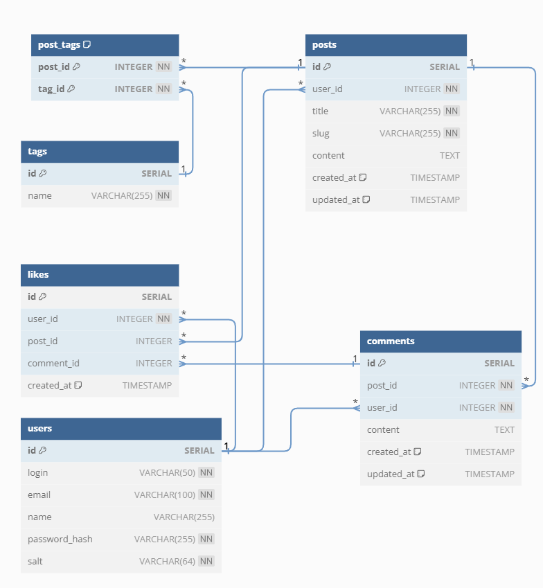

# Why

The purpose of this is just to play around with PostgreSQL. It will setup a database, web ui to manage it and fill it with some test tables and data rows.

You can pretty much use it as a playground to try different PostgresSQL commands such as `SELECT`, `JOIN`, `INSERT` etc.

After you're done you can easily delete everything or reset to the default state.

Below I provided the diagram for this database so you can check relations.

# Requirements

- Docker

# How to run

```bash
# create and fill up the .env file or leave it like is
cp .env.example .env

# run the stack
docker compose up -d
```

The pgadmin interface will be available by [http://localhost:5050/](http://localhost:5050/)

To connect to database through terminal:

```bash
# if you changed .env file you need to put your own user and database name instead of default
docker compose exec -it postgres psql -U admin -d testdb
```

# Reset everything

To stop and reset the database, pgadmin data run the following in the terminal:

```bash
docker compose down -v
```

# Diagram

